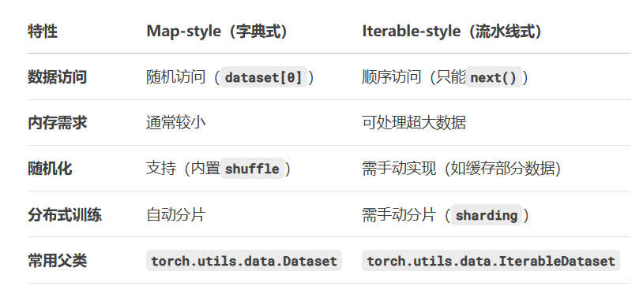

# 前言
使用dir函数可以看到package里面有什么东西哦
使用help（）函数可以看到怎么使用这些东西
jupyter notebook启动jupyter 没啥用
# 关于os
os全称为Operating System，这个模块提供了与操作系统交互的各种函数，我们可以通过这些函数调用计算机底层操作系统的部分功能来快速、高效地管理文件和目录。os 库在数据处理中一个比较常见的功能是批量读取文件路径。
os.path.join(self.data_root,self.data_label)手动拼接路径
当我们得到一个数据集时，Dataset类可以帮我们提取我们需要的数据，我们用子类继承Dataset类，我们先给每个数据一个编号（idx），在后面的神经网络中，初始化Dataset子类实例后，就可以通过这个编号去实例对象中读取相应的数据，会自动调用__getitem__方法，同时子类对象也会获取相应真实的Label（人为去复写即可）
# 关于dataset类
dataset就是告诉我们程序什么数据集在什么地方，它也有对应的标签，也分类，定义了数据的来源、结构和如何访问单个数据样本。

ants_dataset = DataTest("hymenoptera_data/train","ants")
bees_dataset = DataTest("hymenoptera_data/train","bees")
traindataset = ants_dataset + bees_dataset

image, label = traindataset[123]

数据集也可以相加，相当于数组拼接
classes类别：用来分类的
class_to_idx：用来索引分类的标签的，分几种类，这个参就有几个
如果从pytorch的官网加载的数据集它自己会有classes
```py
 
        # 手动创建 classes 属性
        self.classes = ['cat', 'dog', 'bird']  # 硬编码
        self.class_to_idx = {'cat': 0, 'dog': 1, 'bird': 2}
        
        # 或者自动从文件夹生成
        self.classes = sorted(os.listdir(root))
        self.class_to_idx = {cls: i for i, cls in enumerate(self.classes)}
```
但是我自定义数据集它通常会按照我文件夹的命名，自动生成classes，当然你也可以手动设置



# 关于tensorboard
SummaryWriter 是 TensorBoard 在 PyTorch 中的接口，它能够将训练过程中的数据转化为 TensorBoard 支持的格式进行可视化。首先，需要创建 SummaryWriter 的实例，指定日志文件的存储路径：

添加conda终端到vscode     
"Anaconda Prompt": {
            "path": [
                "${env:windir}\\Sysnative\\cmd.exe",
                "${env:windir}\\System32\\cmd.exe"
            ],
            "args": ["%windir%\\System32\\cmd.exe", "/K", "E:\\miniconda3\\Scripts\\activate.bat","E:\\miniconda3"],
            "icon": "terminal-cmd"
        },
生成文件后想可视化，会采用命令，tensorboard --logdir=logs --port = 6006，logdir的名字必须和你SummaryWriter这个类的名字对应，port是端口号避免冲突
## add_scalar（scalar标量）
```python
     writer = SummaryWriter("logs") # 日志文件存储位置
    for i in range(100):
     writer.add_scalar("y = x", i, i) #前一个i是y 后一个i是横坐标
    writer.close()
 ```
## add_scalars 
**只可以用tensor**
用来add_scalars() 允许你在 同一个图表（plot） 中记录多个相关的标量值，这些值会共享同一个 global_step（通常是训练步数或 epoch 数）。
在 TensorBoard 中，这些值会显示为 多条曲线，方便对比它们的趋势。
    ```python3
    import numpy as np  # 添加这行导入语句
    from torch.utils.tensorboard import SummaryWriter
    writer = SummaryWriter("adada")
    r = 5
    for i in range(100):
    writer.add_scalars('run_14h', {'xsinx':i*np.sin(i/r),
                                                'tanx': np.tan(i/r)}, i)
    writer.close()
    ```
## 打印图片格式并且转化image格式为ndarray
image_array = np.array(image)
print(image_array.shape)

# 关于tensor（张量）
tensor类型是相当于把我们输入的东西给包装化，包装成神经网络需要的类型，例如含有反向传播类型，梯度，梯度类型等等，都包含在一起了
包装好了才可以进行神经网络

# 关于transform
transform的结构就是：它本身是一个工具箱，它里面有一堆的类可以把图片进行处理，比如TOtensor Tonparray等等
获得我们想要的格式
## transforms.ToTensor()的使用：
先创建一个transforms.ToTensor的对象
然后用到其里面的__call__的魔法方法，把pil或者ndarray的图片格式传入进去，这样就获得了tensor
注意ToTensor在实例化的时候不需要传入参数
```py
trans_totensor = transforms.ToTensor()
img_tensor = trans_totensor(img)
```
**在TOtensor的时候像素范围已经从0-255变成0-1了**
## transforms.ToPILImage()
这个不常用，用法应该跟Totensor差不多的
## transforms.Compose()
它是 PyTorch 中组织图像预处理流程的核心工具。
用途：按顺序组合多个变换，保证数据输入的一致性。
典型流程：尺寸调整 → 数据增强 → 转 Tensor → 归一化。
重要规则：注意操作顺序（如 ToTensor 必须在 Normalize 之前）。
Compose必须要传入的是transforms类型的数字
```py
trans_compose = transforms.Compose([trans_totensor,trans_resize])
img_resize_2 = trans_compose(img)
```
## transforms.Normalization
归一化（Normalization）又叫正则化、规范化、标准化等，它是一种数据处理方式，能将数据经过处理后限制在某个固定范围内，来方便后面神经网络对数据的处理。
标准化又有点像标准正态分布化
为（样本-均值（你自己给定的））/标准差
```py
trans_norm = transforms.Normalize([0.5,0.5,0.5],[0.5,0.5,0.5])
img_norm = trans_norm(img_tensor)
```
这里的实例化调用__call__的魔法方法只可以用**tensor**的数据类型
Normalize第一参数是均值，第二个是标准差
谨记：
**output[channel] = (input[channel] - mean[channel]) / std[channel]**

## transforms.Resize
等比缩放图片尺寸，可以处理tensor也可以处理PIL Image
```py
trans_resize = transforms.Resize((512,512))
resize_image = trans_resize(img)
```
这里的Resize实例化的时候传入了两个参数，如果只传入一个参数的话：
它会**把最短边设置成你给的参数，最长边按比例缩放**

## transform.RandomCrop()
随机裁剪
初始化这个类的时候，最少需要传入的参数是size
size可以是一个值，那么默认就是裁剪一个正方形
如果是两个值（100，120），那么是长方形
```python
trans_randomcrop = transforms.RandomCrop(
    size=(100, 64),
    padding=20,
    pad_if_needed=True,
    fill= 5,
    padding_mode="constant"
)
```
padding是边缘填充像素
pad_if_needed# 图像太小时自动填充
fill 
**如果我裁剪的对象是PIL那么我可以指定RGB，（R，G，B）。**
**但是我如果处理的是tensor，我只可以给定一个值val，它效果就是填充（val,val,val）**
**但是我如果想填充单颜色，我只能把它先转回PIL再randomcrop**
padding_mode 填充模式

# transform联合torchvision
先讲一下训练集和测试集
训练集：就是用来进行训练的东西，训练出好的参数
测试集，是用来检验的我训练成果的，任何测试集都不该参与任何的训练过程，否则会过拟合
再解释一下过拟合：过拟合就是我们训练出来的参数过于贴合我们的训练集，而对抗实际有所差异
现成的数据集都会有这两个的，同时pytorch也提供了现成的，并且很实用的数据集，在下载的时候，这两个要分别建立对象，具体实现如下
```py
# 训练集 - 给学生用的教材
train_data = datasets.MNIST(
    root='./data',
    train=True,    # ← 关键区别：选择训练集部分
    download=True,
    transform=transform
)

# 测试集 - 给学生用的考卷
test_data = datasets.MNIST(
    root='./data',
    train=False,   # ← 关键区别：选择测试集部分
    download=True,
    transform=transform
) 
```
root一定要指定，其他会有默认的
```python
import torchvision

train_set = torchvision.datasets.CIFAR10(root= "./dataset",train= True,download=True)
test_set = torchvision.datasets.CIFAR10(root= "./dataset",train= False,download=True)
print(train_set[0])
print(train_set.classes)
img, target = test_set[0]

print(img)
print(target)
print(test_set.classes[target])
img.show()
```
这个target返回的就是所属的classes

## 关于dataloader类
名词解释
epoch：把所有的样本都过一遍，仅仅一遍，在一次epoch的时候，训练算法会按照顺序将所有样本进行前向传播、计算损失、反向传播、参数更新等行为，一次epoch更新了一次参数
batch：表示为批次，为一次输入模型的一组样本数量，往往一个dataset的内容很多，如果我们一次全部输入，电脑要卡死了，所以我们分批次传入，效果是有一样的，具体一次样本数量有多少，还要看batch_size
iteration、step：表示为迭代，只模型对全部数据进行了一次epoch后进行了一次数据更新

之前用dataset加载了数据集，不管是来自官方源的下载，还是我们自定义数据集。
但是我们只是给他们加载出来了，但是我们提取还是不方便，所以pytorch提供了dataloader给我们使用
接下来以摸扑克牌为例，讲解dataloader的参数
首先我们用dataset把54张扑克牌洗入牌库，我要每次摸牌要通过dataloader
1. dataset,唯一必须要指定的参数，
2. batch_size一次性输入模型的样本数量
3. shuffle 设为 True 时会在每个epoch重新打乱数据（默认为 False）
4. sampler
5. batch_sampler
6. num_workers 进程数量，用于提高加载数据的效率 ``0`` means that the data will be loaded in the main process.
windows下这个稍微有点问题 ，如果你是多线程，报错BrokenpipeError，那么你只好换成单线程
7. drop_last 这个举个例子，如果我的样本数量是1000，我的batch_size是3，那么意味着我最后一定剩1个，如果这个 drop_last设置为true，那么会舍弃掉最后一个，如果为false，那么最后一个会比较少