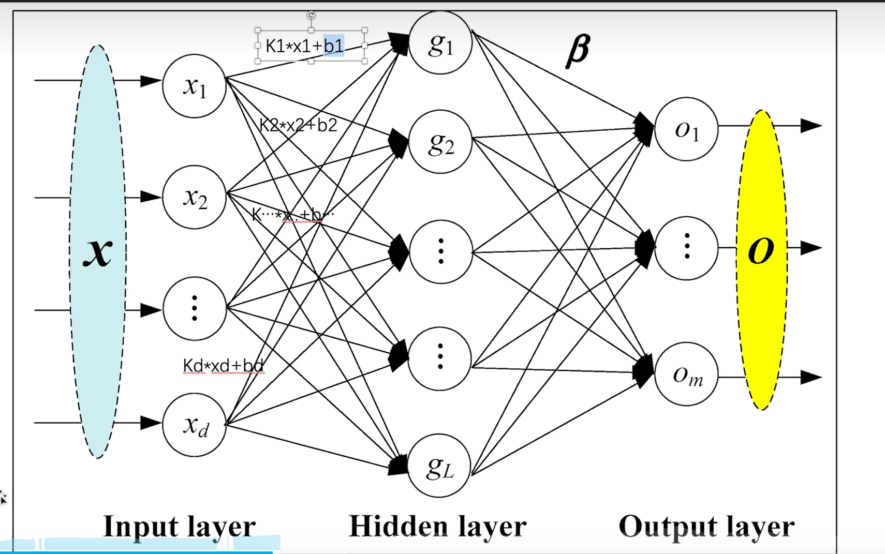
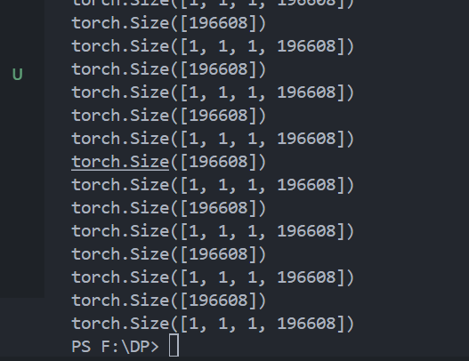
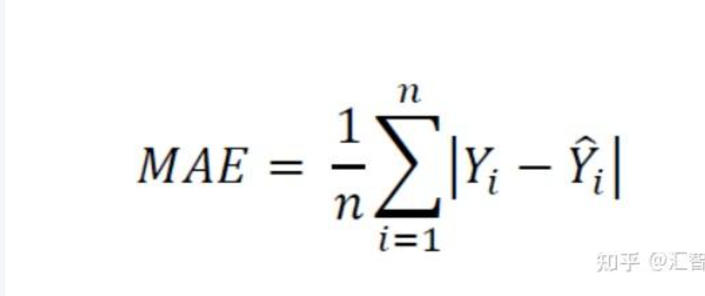
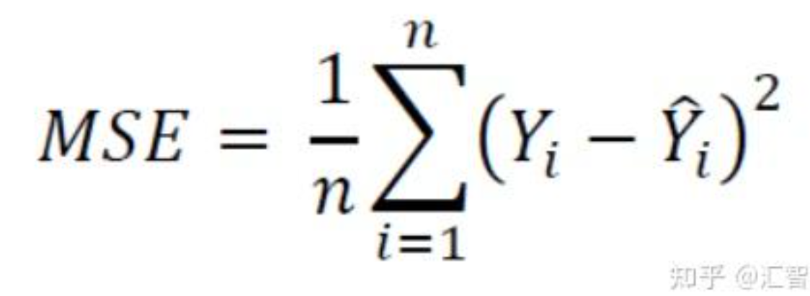
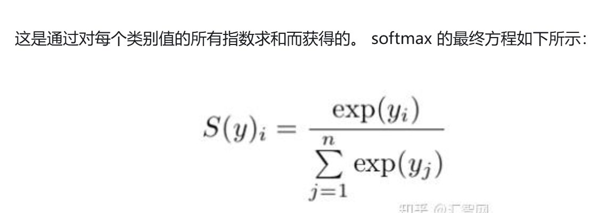
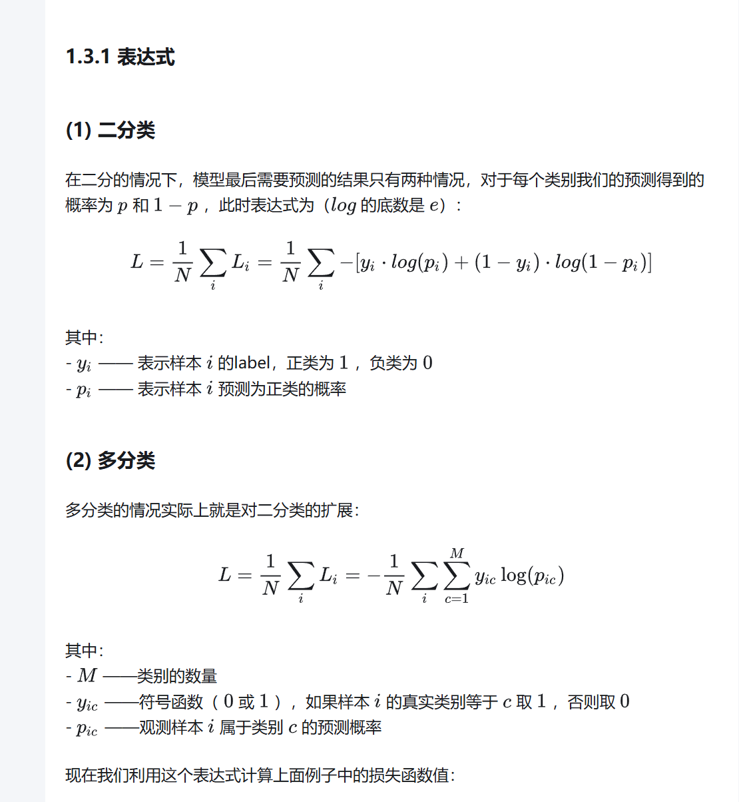
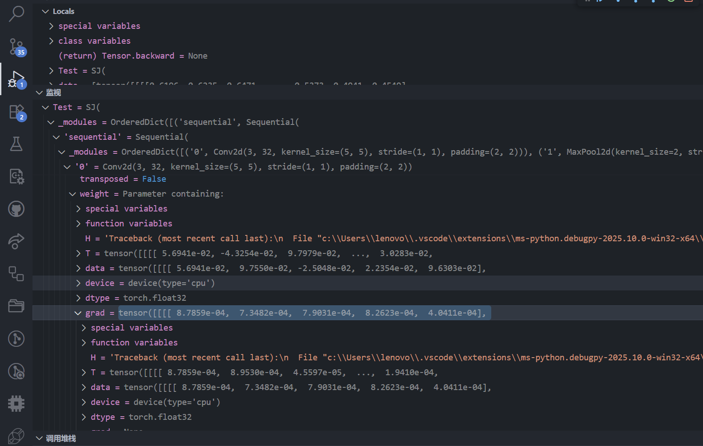

# 神经网络基本框架——来自torch.nn（nn指的是neural network） 
torch.nn 是 PyTorch 中的神经网络模块，它提供了一个框架来定义神经网络层和模型。这个模块包含了构建和训练神经网络所需的所有工具和功能。
Container：这是一个基类，用于构建自定义的神经网络结构，是神经网络的骨架。

torch.nn是torch.nn.functionald的封装
# Container
里面有一个类叫做Module。
大概的意思就是Module为我们所有的神经网络提供了模板，我们搭建神经网络需要继承它，我们对不满意的地方进行修改
eg
```py
import torch.nn as nn

class test(nn.Module):
    def__init__(self):
        super(Module,self).__init__()#这是在初始化父类
        .....

    def forward(self ,x )#这个就是神经网络的前向传播了
        ......
        return 处理后的数据x
```
# convolutipm layers


里面有几个常用的类
1. nn.Conv1d
一维的卷积
2. nn.Conv2d
二维的卷积
主要讲解对象，这个工具包的其余的类的用法差不多的

这些都是函数functional
torch.nn.functional.conv2d(input,weight,bias.stride,padding)
1. input就是你要卷积的tensor(minibatch,in_channels,iH,iW)
minibatch: 批处理大小
    
in_channels: 输入通道数
    
iH: 输入图像高度

iW: 输入图像宽度

**一般打印出来的shape的类型的都是这四个东西**

2. 这个weight就卷积核(kernel)(out_channels,in_channels/groups,KH,KW)

out_channels: 输出通道数

in_channels/groups: 每个输入通道组数

KH: 卷积核高度

KW: 卷积核宽度

**但是我发现直接用torch.tensor 创建一个tensor它的类型shape并不可以传入这个convxd里面，**
**它的shape只有这个数组的大小所以pytorch为我们提供了一个函数叫做“reshape”**

3. bias是偏置

4. stride这个是步长

每次卷积核走几个像素格子，如果你设置成一个数字val（stride = 1）那么意味着横向和纵向的步长都是1

如果是（stride= （1，2））那么横向是1 ， 纵向是2

5. padding如果开padding（意味着给padding一个值例如padding = x）那么如果卷积不够的地方，会自动填充x行x列的0，不写入这个参数默认是不会填充,如果是填充的是（1，2）元组，填充的也是元组

6. dilation
    要**引入空洞卷积**我们正常的卷积核都是紧挨着的，例如一个3X3的卷积核9个元素是紧邻的，如果我们给入dilation，那么他们元素之间会相差1个像素格子的大小，这就叫**空洞卷积**

7. groups


3. nn.Conv3d
三维的卷积

网络的训练其实是一直在训练kernel的参数
**注意：conv2d来自torch.nn.functional 而Conv2d这个类直接来自于torch.nn**

## 下面讲解一下Conv2d的类
```py
    self.cov1 = torch.nn.Conv2d(3, 6, 3, stride=1, padding=0)
```

这是他的初始化

参数：

in_channels这是输入的通道数，你的图片基本来源于拍出来的，所以都是RGB三通道
out_channels这是输出的通道数，你的卷积核的个数也就是他，他有6个不同的卷积核，这个卷积核的初值是随机的,但是这个卷积核的通道数跟你的输入是一致的

详细参考https://zhuanlan.zhihu.com/p/251068800

kernel_size 这是卷积核的大小，可以给定（h，w）也可以给定一个值默认是nXn的大小

stride不多解释

padding不多解释

# Pooling layers

## nn.MaxPool2d 最大的2d池化
参数

1. kernel_size 池化核 ，int/tuple
2. stride 步进长度 这个参数最好不要自己给，如果没有需求的话，它默认会等于kernel_size
3. padding填充
4. dilation空洞
5. return_indices
6. ceil_mode 设置为True是使用ceil的模式，而不使用floor的模式，说白了池化对象的一个通道里的一个值是2.3，floor会向下取整，ceil会向上取整

池化的意思是你指定一个kernel_size,它对这一区域进行操作
我们用到最大池化就是取这个区域的最大值，此外还有均值池化

池化不是卷积，它对一个格子不会重复的进行池化

# Padding layers

这个就有点类似于卷积中的padding
卷积的padding是填充0，但是Padding layers可以填其他的

常用的几个

nn.ZeroPad2d：填0的
nn.ConstantPad2d 填充常数

# non-linear Activations非线性激活层
里面全是非线性激活函数

1. nn.ReLu
这个函数当x<0 f（x） = 0   x>0 f(x) = x

这个ReLu直接传入input就可以了，但是有一个参数inplace

```py
    ReLu(x,inplace = True)
    这样对x进行了ReLu之后不管怎么样，x的值实际上被改变了，如果为Flase则不会
```
2. nn.Sigmod函数
这个函数满足
Sigmod(x) = 1/(1+ exp(-x))

# Normalization Layers 归一化层
这个用的比较少，需要的时候看官方文档

# Recurrent Layers
这个是用作循环神经网络的，用的不是很多
# Transforms Layers

# Linear Layers线性层

torch.nn.Linear(in_features,out_features,bias = true)

参数

1. **in_features** (int): 输入特征的数量（即输入向量的维度）。
一般这个维度跟上一次处理后的维度要对等
或者经理了reshape
2. **out_features** (int): 输出特征的数量（即输出向量的维度）。

3. **bias** (bool, 可选): 如果设置为True，则层中包含一个可学习的偏置项（bias）；默认为True。

注意这个是维度，1维2维三维等等，而不是指出shape




## flatten函数
这个函数是展平函数，可以把任意输入的维度的张量进行展平，展成一维的

但是有一个常见错误，我们用reshape可以把tensor展开成n维的，其余维度的大小全部设置为1，只留一个维度为原张量的元素个数，但是flatten就把全部的元素展开为一维的

例如
output = torch.reshape(imgs,[1,1,1,-1])
test = torch.flatten(imgs)


# Dropout Layers过拟合层
它会以p概率，把输入的tensor部分变成0

# Sequential 顺序

在深度学习和 PyTorch 中，Sequential 是一个顺序容器，用于将多个网络层（或其他模块）按顺序组合成一个完整的模型。它允许用户快速构建神经网络而无需手动定义 forward() 方法，因为层之间的数据流动会自动按照添加的顺序执行。
model = nn.Sequential(
    nn.Linear(784, 256),  # 全连接层
    nn.ReLU(),            # 激活函数
    nn.Linear(256, 10)    # 输出层
)

# Loss_Functions损失函数

里面的参数

1. reduction
默认是mean（取平均），也可以设置为sum，是求和

损失函数（Loss Function）作为神经网络中的一个评估指标，用于衡量神经网络输出与真实标签之间的差异或误差。损失函数通常是一个非负实数函数，表示为L(Y, f(X))，其中Y是实际值（也称为标签或真实值），f(X)是模型的预测值（也称为输出值或估计值），X是输入数据。损失函数的值越小，表示模型的预测结果与实际值越接近，模型的性能也就越好。
https://zhuanlan.zhihu.com/p/548059922

PyTorch 附带的许多损失函数大致分为 3 组：回归损失、分类损失和排名损失。

1.  L1Loss(就是MAE)

计算 output 和 target 之差的绝对值。

2. MSELoss 均方误差

特别是在回归任务中，它比较常用

它计算理论和实际差值的平方，再对他们取均值，这样对偏离比较大的数据惩罚比较严重

3. CrossEntropyLoss 交叉熵损失

https://zhuanlan.zhihu.com/p/573385147

熵指的是一个模型里的混乱函数

交叉熵损失用于涉及多个离散类的分类问题。 它测量给定随机变量集的两个概率分布之间的差异。 通常，当使用交叉熵损失时，我们网络的输出是一个Softmax层，它确保神经网络的输出是一个概率值（0-1之间的值）。

先介绍一下Softmax激活函数

公式如下

其实Softmax就是一个将神经网络输出进行归一化成概率的工具，用来作为多分类问题的目标预测值


可以看出，该函数是凸函数，求导时能够得到全局最优值。

## 关于API
首先Loss function不同的函数的API是不一样的，但是交叉熵需要传入的是经历过神经网络的输出和targets（它的类别）

## 反向传播
在nn.Module里面有forward函数，它是正向传播的过程

但反向传播就在Loss Functions里面，它负责着函数的反向传播，里面有backward的方法，它的原理是根据损失函数的计算，把计算结果反向传播到训练的卷积核以及全连接的系数，再使用优化器不对优化参数，以至于达到最小的损失函数
```py
Test = SJ()
for data in dataloader:
    imgs,targets = data
    output = Test(imgs)
    result = loss(output,targets)
    result.backward()
    print(result)

```



这个就是梯度，但有梯度的前提是，你必须执行了backward的方法，不然数据不会回传的

优化器会利用这些梯度，对神经网络的一些参数进行更新